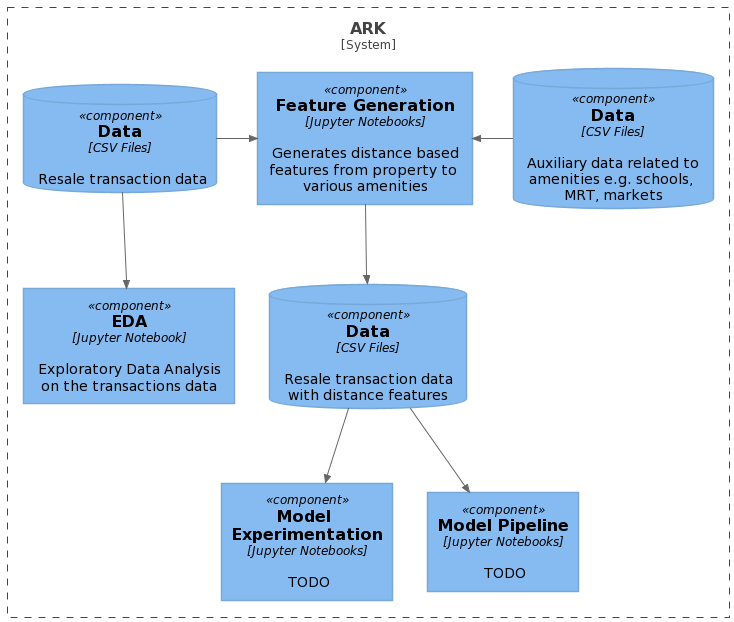

# ARK

## Team
- Raimi bin Karim (A0082893R)
- Azmi bin Mohamed Ridwan (A0225575Y)
- Wang Tian Ming Kenneth (A0116351R)

## Introduction
Singapore has one of the most successful government housing programs in the [world](https://blogs.worldbank.org/sustainablecities/what-about-singapore-lessons-best-public-housing-program-world). According to the latest government [statistics](https://www.singstat.gov.sg/find-data/search-by-theme/households/households/latest-data), 78.7% of all households in Singapore live in government housing vis-a-vis Housing Development Board (HDB) properties.

Given the the strong spending capabilities of its residents supported by a robust economy, coupled with limited land space, it comes as no surprise that the resale market for HDB properties is active.

In such a competitive environment, the ability to be able to price a property optimally is sought after by both sellers and buyers. The objective of this project is to build a price prediction model for HDB resale properties based on its properties. Additionally, analysis is provided so as to understand key features affecting these prices.

This is a project for CS 5228, Knowledge Discovery and Data Mining in Semester 2 2020/2021, [National Unversity of Singapore](www.nus.edu.sg). Detailed explanations is provided in the submitted project report.

## Pre-requisites
In order to run the various code scripts and notebooks, you will need to have installed **[conda](https://conda.io/projects/conda/en/latest/index.html)**, a package and environment manager which is a part of the [Anaconda](https://docs.anaconda.com/anaconda/install/) distribution.

## How to Install

1. Clone a copy of this repository on your local system

`> git clone https://github.com/azmimr/ark_2021.git`

2. Create a new conda environment. This will install Python and the necessary libraries and packages to be able to run the various scripts and notebooks. A new environment named `ark` will be created.

`> conda create env -f conda.yml`

3. Activate the environment

`> conda activate ark`

4. Install pandas-lightning

Run the following command:

`> pip install git+https://github.com/remykarem/pandas-lightning#egg=pandas-lightning`

[Pandas-Lightning](https://pandas-lightning.readthedocs.io/en/latest/index.html) is a Python module created by one of our members (Raimi bin Karim) that wraps around Pandas to provide a simpler interface for some DataFrame operations.

Congratulations! Your environmnent is all setup.

## How to Run

The above diagram illustrates the key components of this solution. To replicate the findings of this project, the following steps are required:

**NOTES** : Jupyter Notebook

To view or execute the various Jupyter notebooks, a server must be running. Start a terminal and run the following command in the main directory of the project folder. 

`> jupyter notebooks` or `> jupyter lab`

### Modelling Pipeline

#### 1. Exploratory Data Analysis

Within the Jupyter interface in a Web Browser, open the Exploratory Data Analysis (EDA) notebook `notebooks\eda.ipynb`. Run all the cells if necessary.

#### 2. Distance-based Feature generation
Using a terminal, run the following program in the main folder of the repository

`> python -m src.create_dist_features data\train.csv`

Where `data\train.csv` is the path to the raw data file.

#### 3. Baseline Modelling

Open `notebooks\experiment_1.ipynb` in a Jupyter instance to see the code for the base line models. These model use the basic features directly from the training data. The notebook includes some observations related to the feature importance and model performance.

#### 4. Feature Engineering, Model Selection, Hyperparameter Tuning, Ensembling and Test Data Inference
The last notebook `notebook\experiment_2.ipynb` is the following aspects of the project:

- Feature Engineering: Using the data that includes feature-based features, create additional features
- Feature Selection: Several different models were created using different algorithms
- Model Ensembling: The final model was created by ensembling 
- Inference on the test data for the Kaggle competition submission. Please apply the distance feature generation script (step 2) on the test data before ingesting into this notebook.

## Conclusion

For this project, we were able to achieve an RMSE error of S$16,317.19 for our final submitted model.

