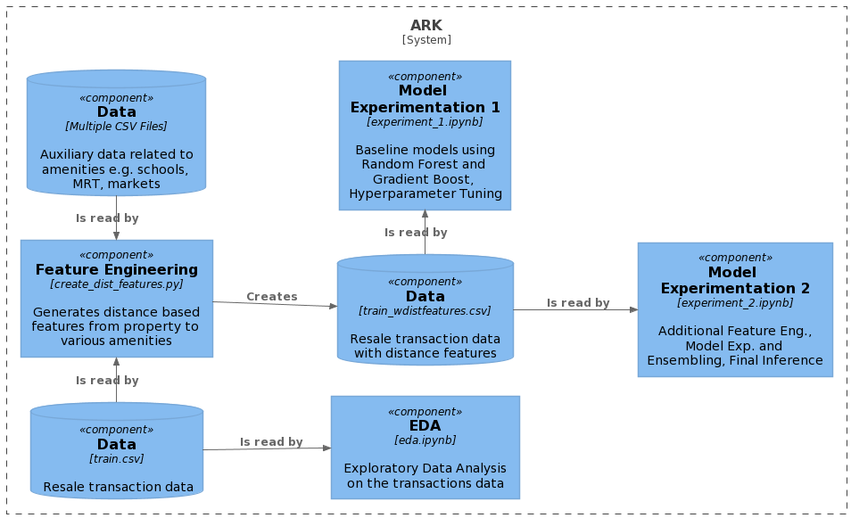

# ARK

## Team
- Azmi Mohamed Ridwan
- Raimi Karim
- Kenneth Wong

## Introduction
Singapore has one of the most successful government housing programs in the [world](https://blogs.worldbank.org/sustainablecities/what-about-singapore-lessons-best-public-housing-program-world). According to the latest government [statistics](https://www.singstat.gov.sg/find-data/search-by-theme/households/households/latest-data), 78.7% of all households in Singapore live in government housing vis-a-vis Housing Development Board (HDB) properties.

Given the the strong spending capabilities of its residents supported by a robust economy, coupled with limited land space, it comes as no surprise that the resale market for HDB properties is active.

In such a competitive environment, the ability to be able to price a property optimally is sought after by both sellers and buyers. The objective of this project is to build a price prediction model for HDB resale properties based on its properties. Additionally, analysis is provided so as to understand key features affecting these prices.

This is a project for CS 5228, Knowledge Discovery and Data Mining in Semester 2 2020/2021, [National Unversity of Singapore](www.nus.edu.sg). Detailed explanations is provided in the submitted project report.

## Pre-requisites
In order to run the various code scripts and notebooks, you will need to have installed **[conda](https://conda.io/projects/conda/en/latest/index.html)**, a package and environment manager which is a part of the [Anaconda](https://docs.anaconda.com/anaconda/install/) distribution.

## How to Install

1. Clone a copy of this repository on your local system

`> git clone link_to_git_repo`

2. Create a new conda environment. This will install Python and the necessary libraries and packages to be able to run the various scripts and notebooks. A new environment named `ark` will be created.

`> conda create env -f conda.yml`

3. Activate the environment

`> conda activate ark`

Your environmnent is all setup!

## How to Run

The above diagram illustrates the key components of this solution. To replicate the findings of this project, the following steps are required:

1. To view or execute the various Jupyter notebooks, a server must be running. Run the following command in the main directory of the project folder. 

`> jupyter notebooks` or `> jupyter labs`

2. Exploratory Data Analysis, `eda.ipynb`: This notebook blah, blah, blah

3. Distance-based Feature generation, `xy.ipynb`: Using both the transaction and auxiliary data, 3 distance features are generated for each amenity type; a) Count of amenities within 2km, b) Count of amenities within 1km and c) Distance to closest amenity (in metres).

## Notes

